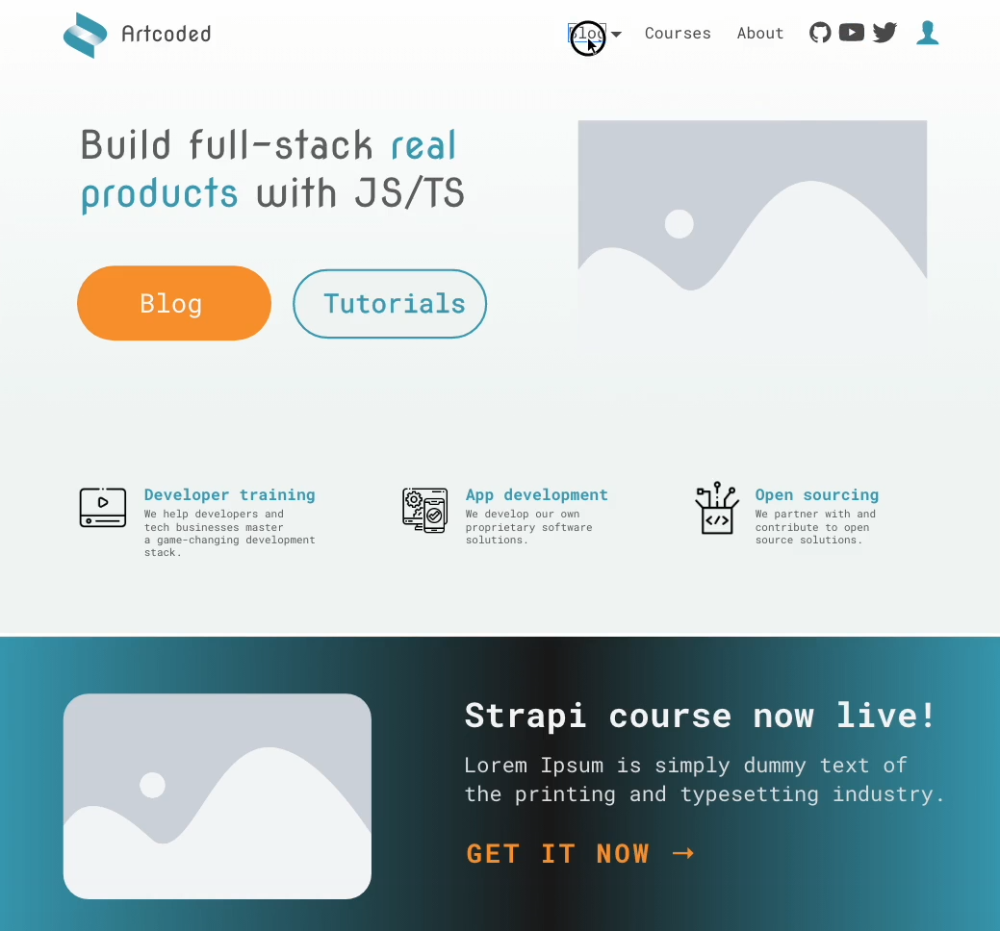
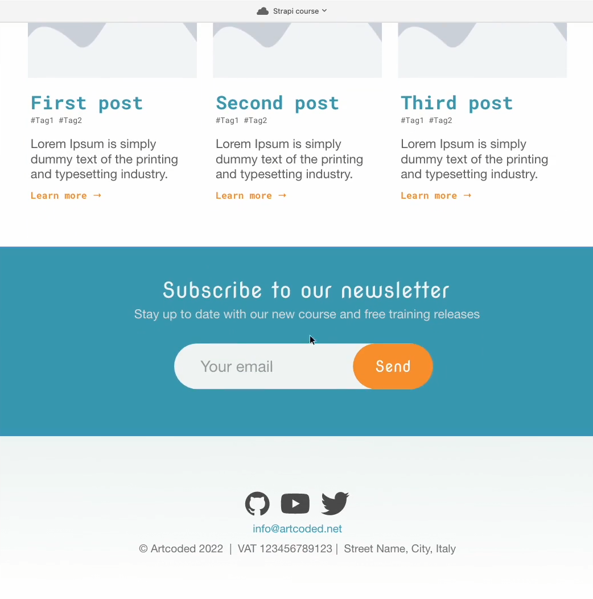

# Course Project: an overview  

## Introducing our Developer blog application  

- Throughout this course we'll be building the **backend for a hypothetical blog/website** for a solo-developer or micro-company like mine
- This site will have a **blog** (with Posts and Tags)and will also list Courses, development **Services** and showcase dev **Projects** (optionally created from Github repositories)
- To create our Strapi backend features we'll be often **thinking backwards from what a frontend-developer might want to perform** (e.g. showing a new course announcement, creating a site Header, etc.)
- So we'll think of our backend CMS as a way to properly **serve** the needed content to the front-end, while also allowing content editors to **create** that content.  

