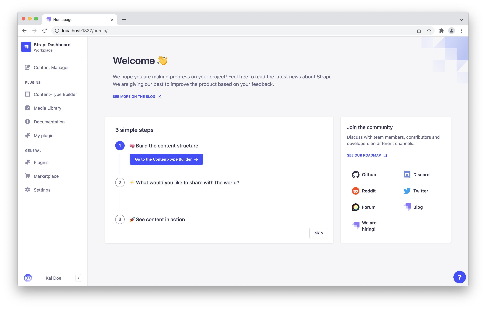

# [Strapi Quick Start Guide](https://docs.strapi.io/developer-docs/latest/getting-started/quick-start.html)  

## Part A: Create a new project with Strapi  

1. Run the installation script  
Run the following command in a terminal  
`npx create-strapi-app@latest dev-blog --quickstart`  

2. Register the first administrator user  
Once the installation is complete, your browser automatically opens a new tab.  
By completing the form, you create your own account. Once done, you become the first administator user of this Strapi application. Welcome aboard, commander!  
You now have access to the [admin panel](http://localhost:1337/admin/auth/login)  

  

🥳 CONGRATULATIONS!

You have just created a new Strapi project! You can start playing with Strapi and discover the product by yourself using our [User Guide](https://docs.strapi.io/user-docs/latest/getting-started/introduction.html), or proceed to part B below.