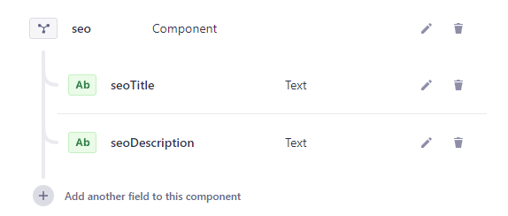
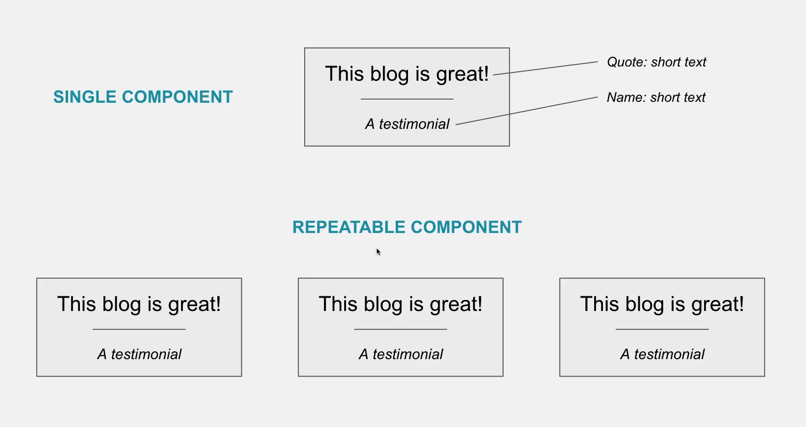

# Components  

## Don't repeat yourself: use components  

**DRY -> Don't repeat yourself**  

- seoTitle and seoDescription fields will be also needed for **other content types**, such as our home page and other pages
- When this is the case, consider creating a **component** to foster code reuse
- We will create a **Seolnformation component** that includes seoTitle and seoDescription fields  

  

## Single Component vs Repeatable Component  

  