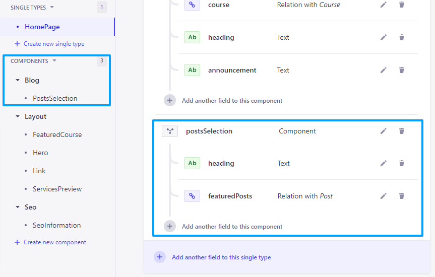

# Creating a Component for Posts Selection  

## Give Content Editors some more Freedom  

This is an alternative design, we are going to have a section dedicated to posts with an optional relation with posts.  

If the editor includes a relation with one or more posts, this will be a featured post section that shows those specific posts. But if he doesn't and just include this component with a header, but without any specific relation with posts, well, in our Frontend we asume that we have to show the latest posts.

