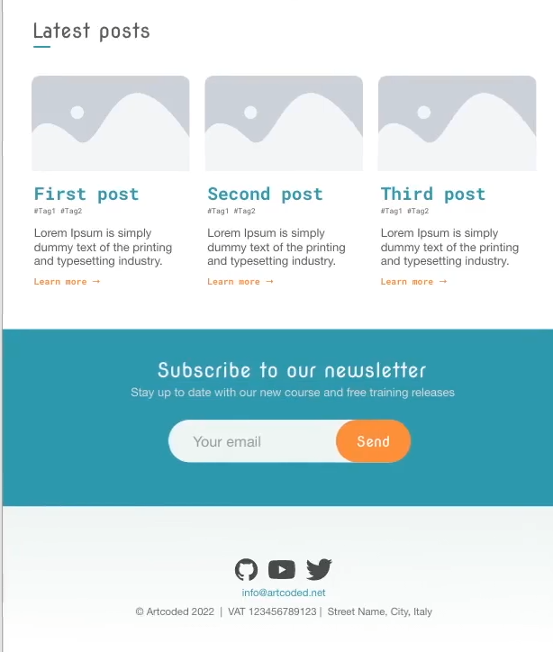
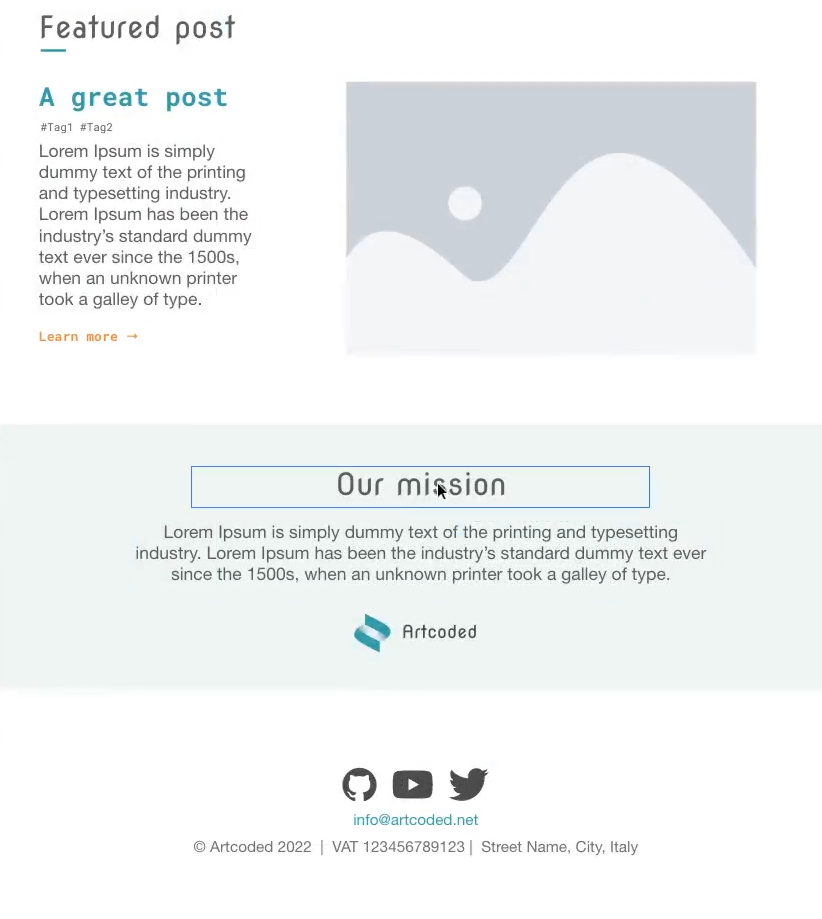
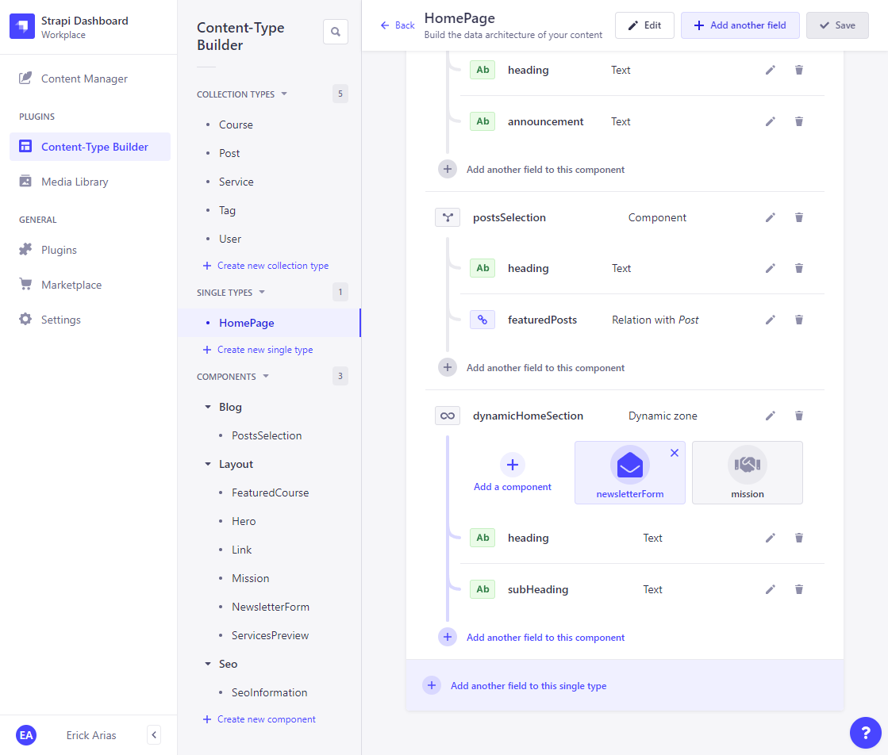
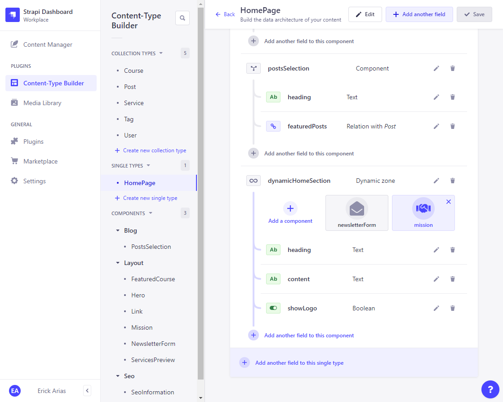

# Creating a Dynamic Zone  

## What if our editor doesn't want to include the newslater section?  

## And at certain point replaces the newsletter section with an Our Mission Section?  

  

## Or what if the editor wants to include both sections?  

That's where dynamic zones come handy for us.  

- *Create the two components and include them in a dynamic zone, that basically allows editors to choose if they want to include one or another component, or event both.*  

### Newsletter Section into Dynamic Zone (Home)

  

### Our Mission Section into Dynamic Zone (Home)

