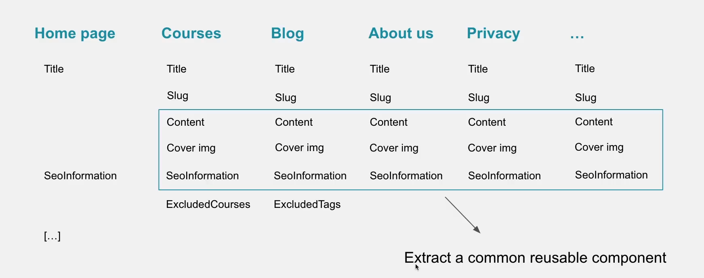
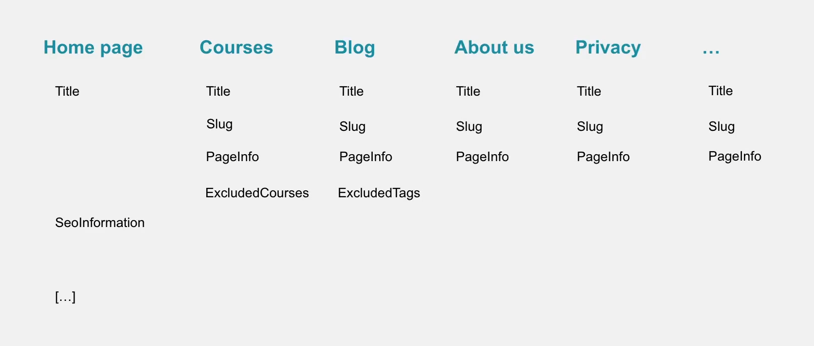
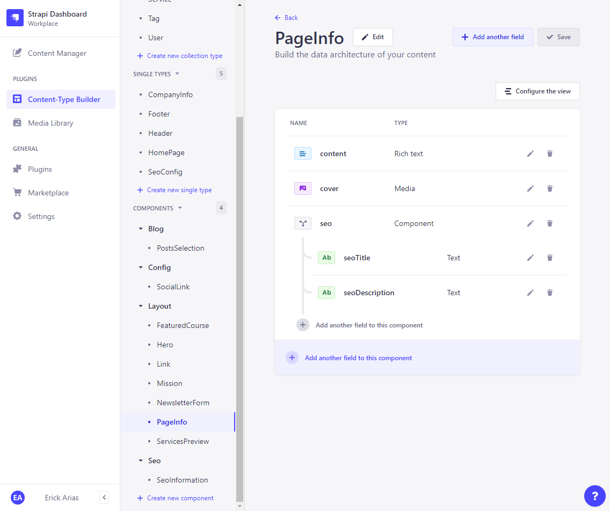
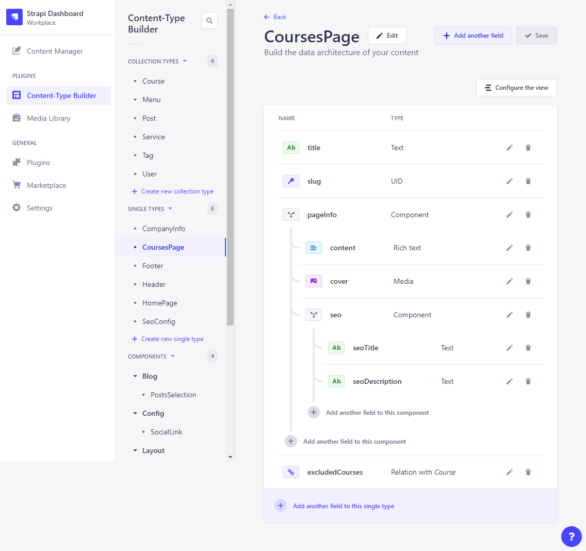
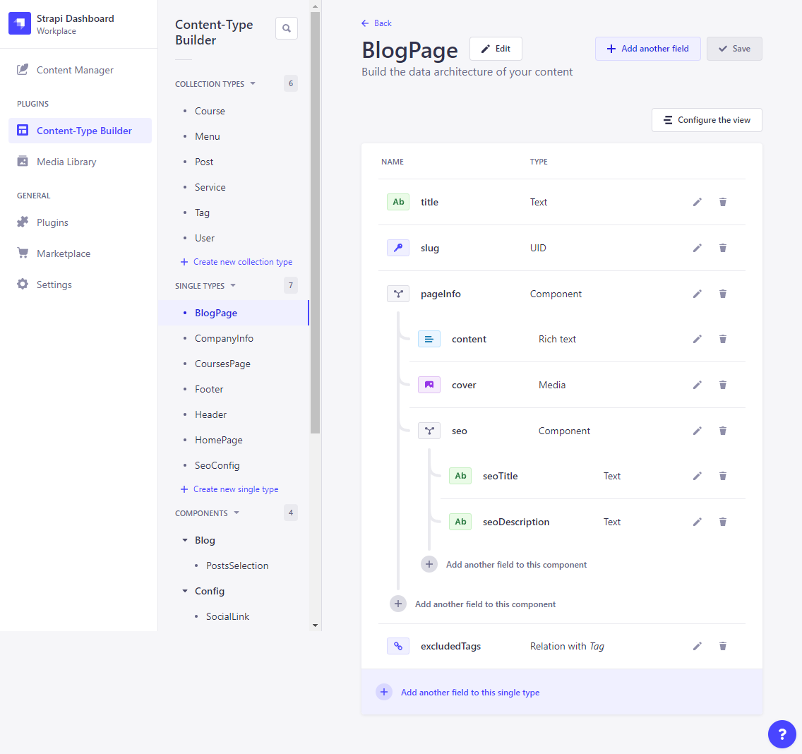
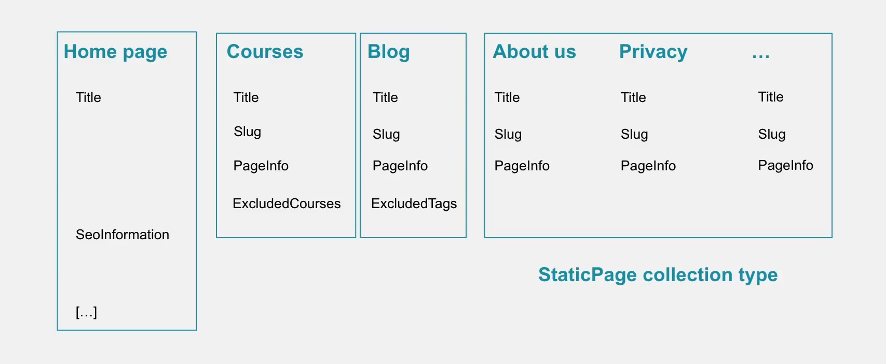
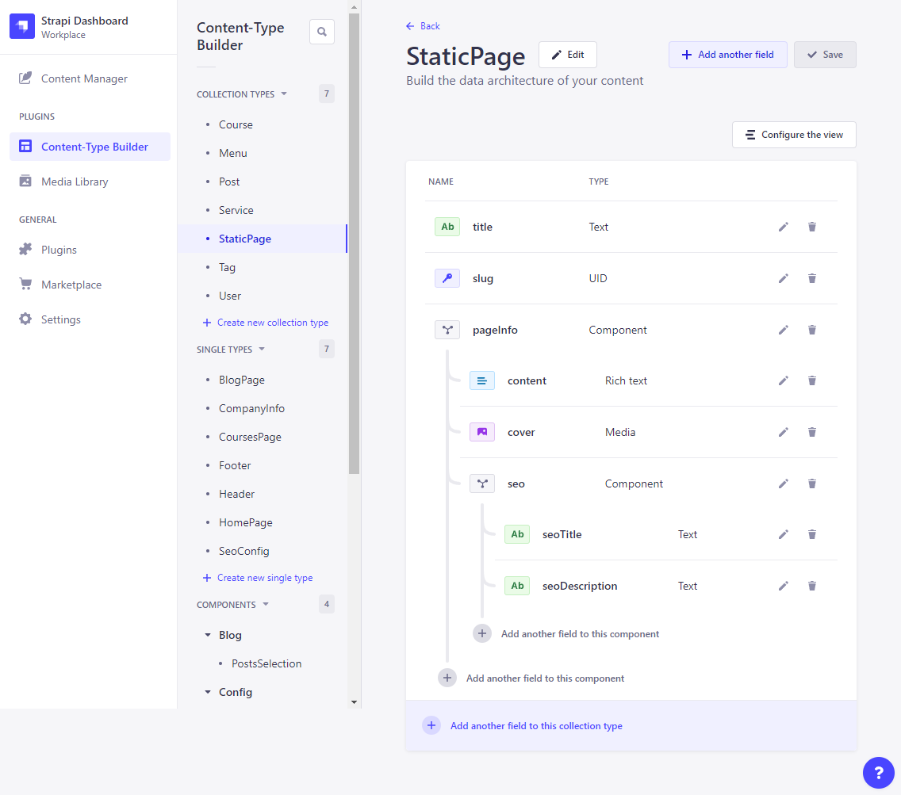

# Finishing the Blog Application  

## Designing Our Pages Data Types  

### Extract Common Reusable Component  

  

### Shape these pages will have  

   

### Generating Page Info Component  

  

### Generating Courses Page (Single Content Type)  

  

### Generating Blog Page (Single Content Type)  

  

### Static Page Collection Types  

  

### Generating Static Page (Collection Types)  

  