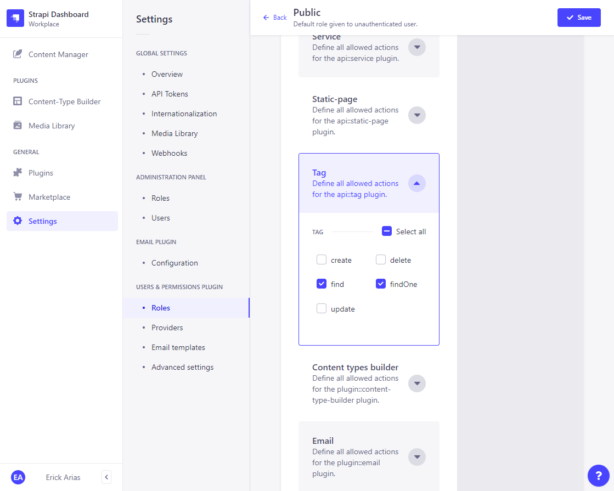

# Performing Public API Operations  

## [REST API Documentation](https://docs.strapi.io/developer-docs/latest/developer-resources/database-apis-reference/rest-api.html)  

## [Endpoints](https://docs.strapi.io/developer-docs/latest/developer-resources/database-apis-reference/rest-api.html#endpoints)  

### Collection Type  

  

### Single Type  

  

## Users & Permissions Plugin  

It allows you to **control** what operations external **applications and their users** can/cannot perform on your data.  

### Roles   

  

#### Public Role: Post  

  

#### Public Role: Tag  

  

### After Applying those allowed Actions, here is the Result:  

```js
// http://localhost:1337/api/posts

{
    "data": [
        {
        "id": 1,
        "attributes": {
            "title": "Create a Next JS blog with Strapi",
            "content": "**This is a post on Next JS with Strapi**",
            "slug": "create-a-next-js-blog-with-strapi",
            "createdAt": "2022-08-25T04:11:21.527Z",
            "updatedAt": "2022-08-25T04:11:41.751Z",
            "publishedAt": "2022-08-25T04:11:41.745Z"
        }
        }
    ],
    "meta": {
        "pagination": {
        "page": 1,
        "pageSize": 25,
        "pageCount": 1,
        "total": 1
        }
    }
}
```  

### How app user access your data: public data/operations  

- Every content type is restricted by default, i.e. it is not available for public access nor for authenticated users
- Public operations are the ones you explicitly allow for public users under **Settings → Users & Permissions Plugin → Roles**
- These operations are then freely available via the API without any kind of authentication  

### Here is how it works  

