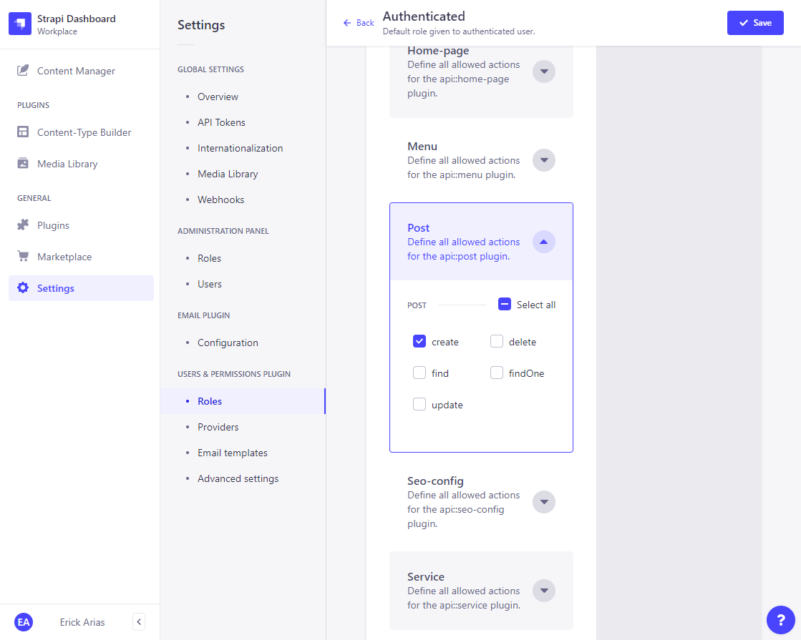
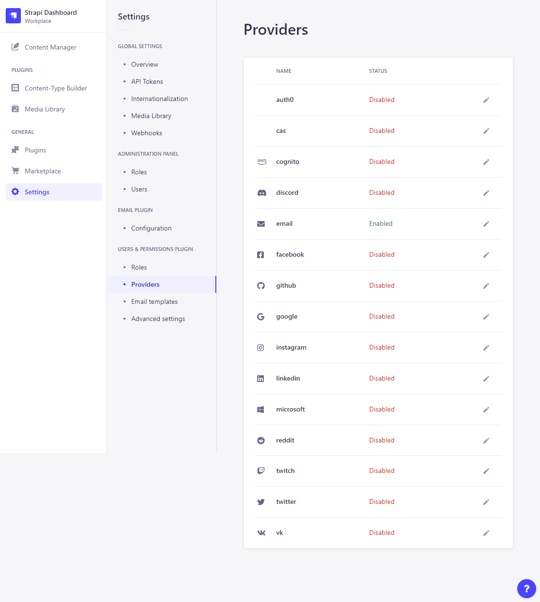
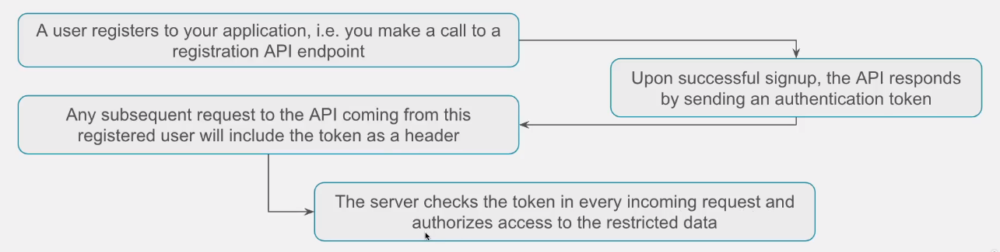

# Authentication & Authorization: The Theory  

## Assumption  

Registered users of our front-end website must be able to **create "guests posts"**  

### Authenticated Role: Post  

  

## How app users access your data: restricted data/operations  

- Strapi has a built-in authentication system with which users can authenticate to your application (e.g. in your website or app)
- You can have them register via email/password or via many third party auth providers (you activate them under **Settings → Users & Permissions Plugin → Providers**)

- Operations that you mark as permitted only to authenticated users need an **authorization process**
- Strapi's authorization system is based on **JWT** (Json Web Token)  

### Here is how it works  

