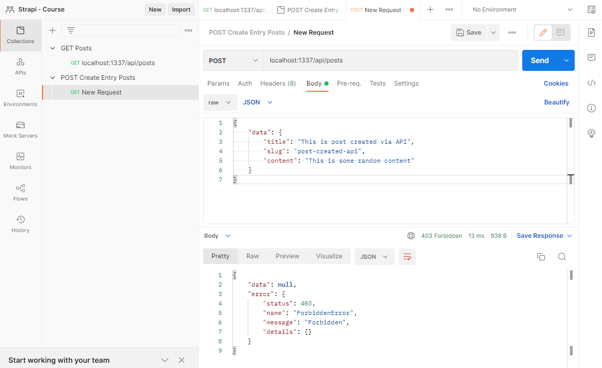
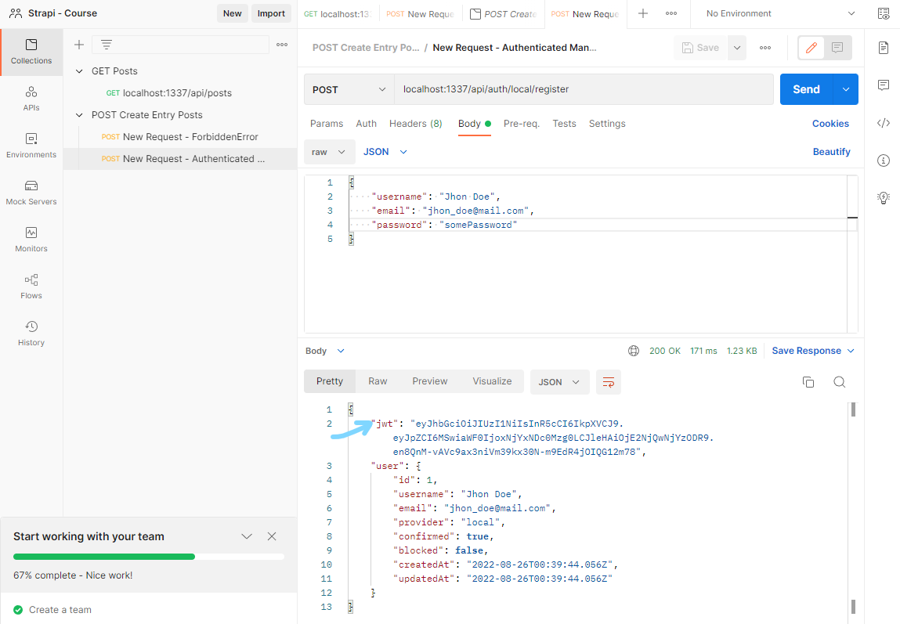
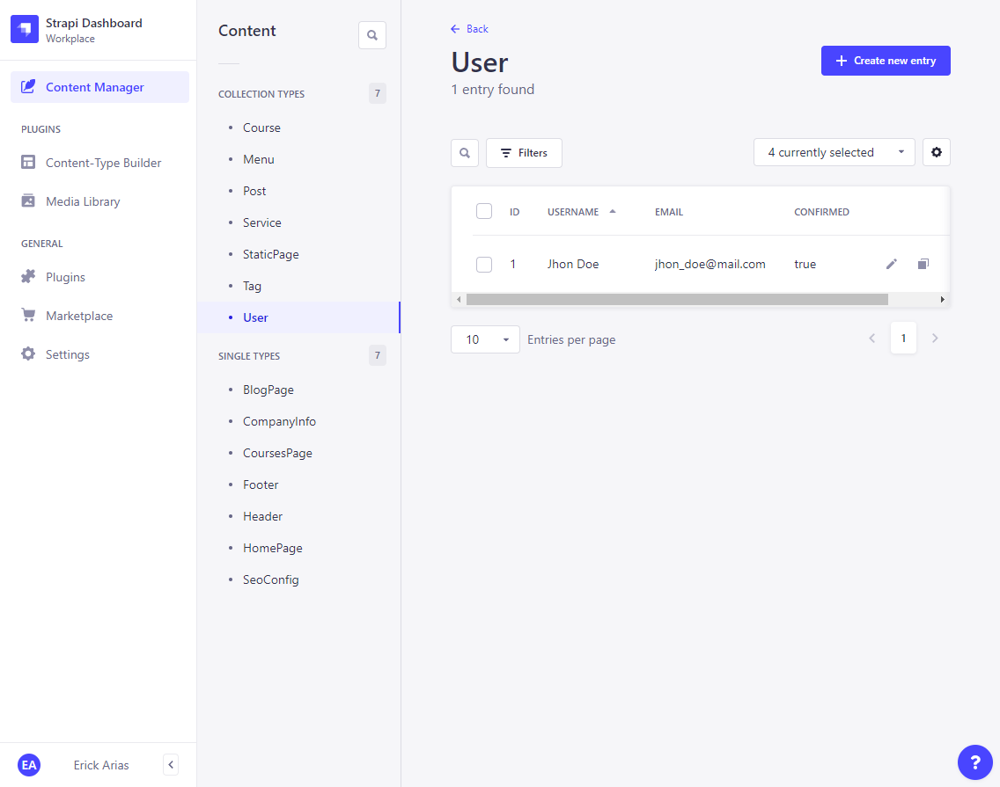

# Performing User Authentication Via API  

## ForbiddenError Trying to Post because there is No Authentication  

  

## Authenticated Manually - Post Correctly  

  

## User Created Via API  

