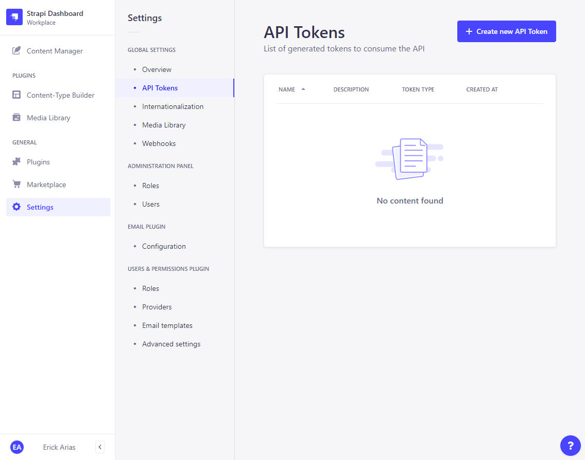

# API Tokens  

## Manually Generate API Token from Strapi

  

## How app users access your data: Manual Tokens  

- JWT tokens can be also manually generated to allow authenticated access to **external sources**, different than individual users (e.g. other servers)
- The process is similar, you just **manually generate a token** under **Settings → Global Settings - API Tokens** instead of this being automatically generated after a user authentication
- Similarly to authenticated users' requests, the external source will always **include the token in its API requests**